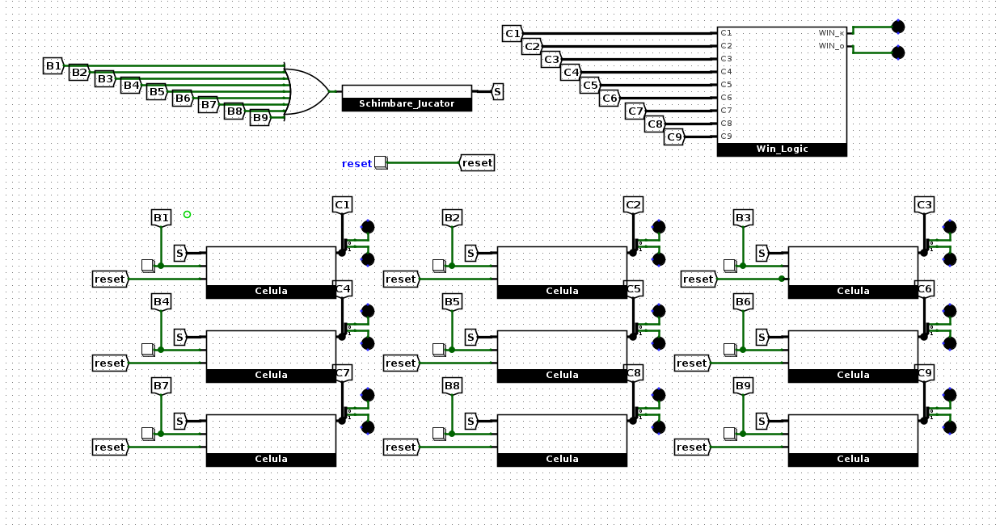

# Tic-Tac-Toe Digital Circuit (Logisim)

A fully functional Tic-Tac-Toe game built entirely using digital logic circuits in Logisim-Evolution. The project implements cell state memory, automatic player switching, win condition detection, and a global reset system.

## Key Features

- **Interactive 3x3 Grid**: Each cell is an independent sub-circuit with its own memory.
- **Non-Volatile Memory (per round)**: Once a cell is marked (X or O), it locks and cannot be overwritten until the game is reset.
- **Automatic Player Controller**: The circuit automatically switches turns between Player 1 (X) and Player 2 (O) with each valid button press.
- **RGB Visual Display**: Uses RGB LEDs for instant feedback: Red for X and Green for O.
- **Win Logic**: A dedicated "brain" that simultaneously checks all 8 possible winning lines (horizontal, vertical, and diagonal).
- **Global Reset**: A single button that returns the entire board and controller to the initial state.

## Project Structure

### 1. Main Circuit

This is the assembly point where all 9 cells are connected to the central controller and win logic. It uses a Tunnel system to keep the schematic clean and easy to read.

### 2. Cell Sub-circuit

Each cell contains:

- A **2-bit Register** for storing the symbol.
- **Control logic** with a NOR gate acting as a "Write Enable", preventing symbol changes after it has been set.

### 3. Player Switch Sub-circuit

Manages whose turn it is:

- Uses a **T Flip-Flop** to toggle the state with each pulse received from the board buttons.
- A **Multiplexor (MUX)** sends the value `01` (X) or `10` (O) to the entire board.

### 4. Win Logic Sub-circuit

Checks the board state through:

- **8 AND gates** with 3 inputs (one for each winning line).
- **Splitters** that separate bits to individually detect X or O victory.

## How to Play

1. Open the `.circ` file in Logisim-Evolution.
2. Enable simulation (Simulate -> Simulation Enabled).
3. Use the Poke tool (Hand) to press the buttons below the cells.
4. When a player gets 3 in a row, the corresponding LED (`WIN_x` or `WIN_o`) will light up.
5. Press the Reset button to start a new game.
